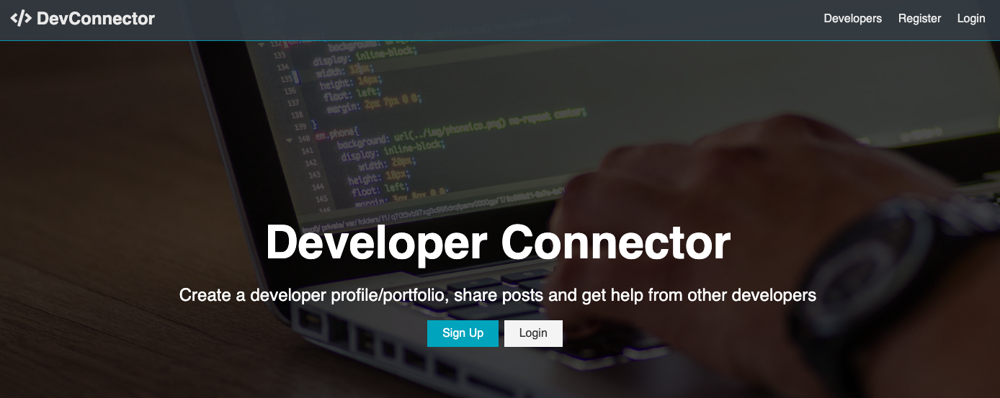
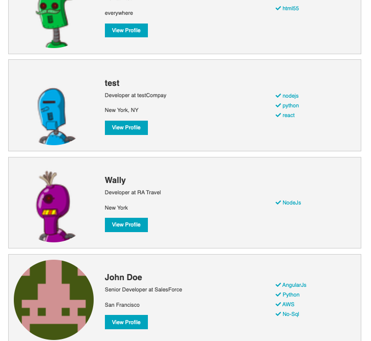
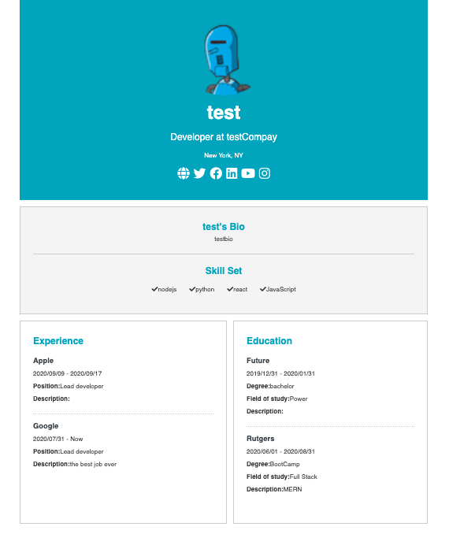
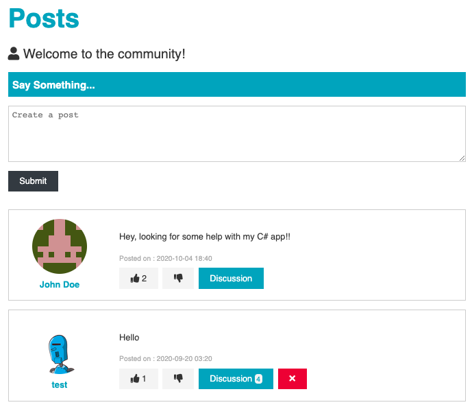

# DevConnector

Dev connector is a MERN stack app, the app is a small scale social platform with several features. the idea of the app is to create a network for developers where users will access other developers profiles, with experiences, skills and links Github and social media profiles. user will have the option to connect with their Github accounts as top 5 repos will be displayed on profile. also user can connect with the community by posting in the post section, users will be able to respond back with a reply or pressing the like bottom.

# Link To Deployed Heroku Site:

https://zdev-connector.herokuapp.com/

# Instructions

- Sign-Up/Log in
- After signing up(creating account) user will be asked to create a profile where a form will be filled out with current job title, company, github username, website... etc
- in profile user can add all past experiences and educations.
- user can browse between developer profiles by clicking on Developer from the toolbar, all profile will be displayed.
- by clicking on one profile image, a developer profile will be displayed with all its info
- also developers can communicate and interact from the posts page where they can open topics and comment(replay) or even like each others post.

 <strong>Home Page </strong>  
 <strong>Sign up</strong>   

 <strong>Profiles list</strong>   
 <strong>Profile Display</strong>   
 <strong>Posts</strong>   

# Technologies Used

- React
- Redux
- Javascript
- CSS Module
- MongoDB Atlas
- mongoose
- bcryptjs
- express
- express-validator
- Webpack
- jsonwebtoke
